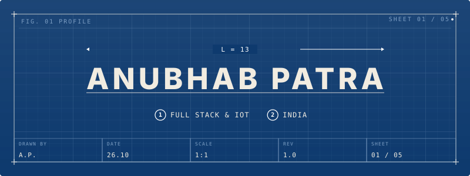

<div align="center">
  
</div>

<div align="center">

[](https://linkedin.com/in/anubhab-patra-621b6227a/)
[](https://x.com/apz_999/)
[](https://anubhab-patra.vercel.app/)

</div>

<br>

## `> currently_working_on`

```
> FRONTEND WEB DEV
  building interfaces with React / Next.js — component architecture,
  animation, and clean, deliberate UI.

> BACKEND ENGINEERING
  actively building backend systems — FastAPI and Node services,
  database design, API architecture — while going deeper into what
  matters at scale: caching, queues, concurrency, auth.

> IoT & ROBOTICS
  hands-on work with Raspberry Pi, Arduino, and ESP32 — sensors,
  motor control, real-time embedded systems.

> AI / ML — RAG SYSTEMS
  learning core AI/ML concepts and going deep into RAG — how
  retrieval, chunking, embeddings, and vector search combine with
  LLMs to ground generation in real, up-to-date data.
```

<br>

## `> tech_stack`

<div align="center">


</div>

<br>

## `> github_stats`

<div align="center">


<br>


</div>

<br>

## `> contribution_graph`

<div align="center">
  
</div>
